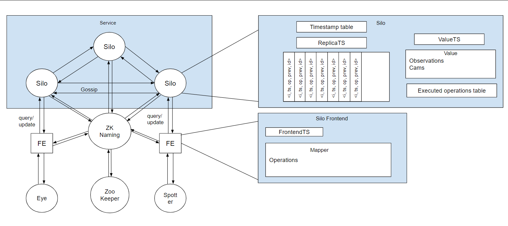

# Relatório do projeto Sauron

Sistemas Distribuídos 2019-2020, segundo semestre

## Autores

**Grupo A04**

 

| Número | Nome              | User                             | Email                                                     |
| -------|-------------------|----------------------------------| ----------------------------------------------------------|
| 89399  | Afonso Gonçalves  | <https://github.com/afonsocrg>   | <mailto:afonso.corte-real.goncalves@tecnico.ulisboa.pt>   |
| 89427  | Daniel Seara      | <https://github.com/Beu-Wolf>    | <mailto:daniel.g.seara@tecnico.ulisboa.pt>                |
| 89496  | Marcelo Santos    | <https://github.com/tosmarcel>   | <mailto:marcelocmsantos@tecnico.ulisboa.pt>               |

 
  

## Melhorias da primeira parte

 * O conjunto de testes foi melhorado.
    * [Added load test to report](https://github.com/tecnico-distsys/A04-Sauron/commit/70a1cda17eb81cea50e55d32ae13052a0b54d1af)
    * [Added verification of coordinates](https://github.com/tecnico-distsys/A04-Sauron/commit/a7f573348f1d560f1c656fc5e5258a5a4123c529)

 * A resposta ao `CamInfo` passa a retornar apenas as coordenadas da câmara, em vez de retornar a câmara em si.
    * [Update proto to send coords in cam info](https://github.com/tecnico-distsys/A04-Sauron/commit/c7bc13b00d9e540ea367eb94c47af874e8a7642b)

 * Os objetos de representação de informação usados no cliente (`...DTO`) foram renomeados para objetos do domínio (`Frontend...`). Os objetos do domínio do cliente e servidor não foram unificados para manter a abstração e o isolamento dos dois.
    * [Rename DTO](https://github.com/tecnico-distsys/A04-Sauron/commit/1146664b562161ba149b6084e0632dc6340382a5)
    * [DTO package to domain](https://github.com/tecnico-distsys/A04-Sauron/commit/e77937cbea6a4430804c80e63f7396d58b455a6f)

 * Os requests de gRPC que eram feitos usando streams e metadados foram alterados para usar campos `repeated`. Todos os argumentos passaram a ser explicitamente passados dentro do corpo da mensagem.
    * *As alterações foram desenvolvidas incrementalmente ao longo de vários commits, no branch `grpcRefactor`.*
    * [Histórico de commits](https://github.com/tecnico-distsys/A04-Sauron/commits/grpcRefactor)
    * [Primeiro commit da melhoria](https://github.com/tecnico-distsys/A04-Sauron/commit/6776f84bb2e991349f311d1f313ab7afc59ec12a)
    * [Último commit da melhoria](https://github.com/tecnico-distsys/A04-Sauron/commit/4101f632e92975d5170ee29e798c154b73eb18da)

 * A mensagem usada para fazer pedidos de `Track`, `Trace` e `TrackMatch` foi dividida em diferentes mensagens, uma para cada request.
    * [Separate QueryRequest/Response](https://github.com/tecnico-distsys/A04-Sauron/commit/9fb98d61550271844a01b61e8fb640826241dbcb)

## Modelo de faltas
**TODO: STILL WIP**
_(que faltas são toleradas, que faltas não são toleradas)_

Esta solução tolera as faltas requeridas pelo Modelo de Interação de Faltas do enunciado deste projeto:

 * Crash de uma réplica sem updates críticos para o estado de outras réplicas;
 * Updates enviados fora de ordem;
 * Crash no fronted de cada cliente;
 
Contudo, esta solução não tolera:
 * Falhas no ZooKeeper
 * Crash numa réplica com updates críticos para o estado de outras réplicas
 * Instâncias de réplicas atribuídas de forma não incremental

 * Para garantir que uma replica possa falhar temporariamente, nao podemos apagar o update log das replicas, para que as que falham consigam recuperar o seu estado.

## Solução

A solução implementada foi baseada no *Gossip Architecture*, descrito em *Coulouris, George F. Distributed Systems : Concepts and Design. Boston, Addison-Wesley, 2012*. Cada réplica tem o seu estado interno (`Value`) associado a um timestamp vetorial (`Value timestamp`). Este timestamp representa a versão do estado da réplica, resultante da execução cumulativa de um conjunto de atualizações. Para além destes componentes, existe ainda um `Update Log`, que contém um conjunto de atualizações que a réplica ainda não executou.

Os updates estão associados ao timestamp (`prevTS`) que a entidade que o criou tinha no momento da sua criação. Os updates apenas podem ser executados quando o `Value timestamp` da réplica for posterior ao `prevTS` do update, pois apenas aí se pode garantir que a réplica tem um estado mais atualizado do que o estado que originou o update. Deste modo, é possível garantir a dependência causal.

As réplicas atualizam-se regularmente (de 30 em 30 segundos por *default*, mas pode ser configurado), enviando umas às outras mensagens de update (`Gossip Message`), contendo as entradas existentes no `Update Log` da réplica que as enviou. A réplica que as recebe adiciona-as ao seu `Update Log`, para serem executadas assim que possível. Por uma questão de simplicidade, aconselhada no feedback da primeira entrega, as entradas do `Update Log` foram enviadas num campo `repeated` da mensagem de gossip definida no gRPC. Esta abordagem tem uma limitação: Como apenas é possível enviar 4MB por mensagem, há a possibilidade que num perído de pico de atividade, as réplicas não consigam enviar todos os updates que tẽm para enviar. Será necessário estimar uma frequẽncia de atualização das réplicas adequada para que isto não aconteça **[TODO: ???]**.

O modelo até agora descrito permite que as réplicas enviem *updates* que o seu destino já tenha registado, podendo levar a duplicação de instruções (quando estas não forem idempotentes será problemático) e a um congestionamento desnecessário da rede. O primeiro problema é mitigado atribuindo um ID único (`opId`) a cada *update*: Antes de uma réplica adicionar um update ao seu `Update Log`, esta verifica se ainda não a acrescentou. O `opId` é criado usando um gerador aleatório de **[TODO: NOME E PROS E CONTAS?]**. O segundo problema pode ser atenuado se as réplicas forem registando o *timestamp* mais atual das outras e enviarem apenas os updates que a réplica de destino garantidamente ainda não tenha visto. Para tal, ao enviar uma `Gossip Message`, a réplica envia também o seu `Value timestamp`, que é guardado na `Timestamp Table` da réplica destino.

Sempre que uma réplica recebe uma `Gossip Message`, há a possiblidade de receber updates críticos para a atualização do seu estado. Desse modo, a réplica verifica que updates do seu `Update Log` é que podem ser executados. Ao receber um *update* de um cliente, este é adicionado ao `Update Log` e imediatamente executado se o `prevTS` associado a este for anterior ao `Value timestamp` da réplica.

## Protocolo de replicação
_(Explicação do protocolo)_

_(descrição das trocas de mensagens)_

O protocolo seguido foi uma variante do _Gossip_ estudado nas aulas práticas. As réplicas respondem sempre ao cliente,
garantindo uma alta disponibilidade e tolerância a partições de rede. No entanto seguem uma filosofia de updates "relaxados",
em que apenas é garantido que eventualmente as réplicas estarão coerentes. O segredo do protocolo reside em **timestamps vetoriais**
que permitem representar o estado de cada réplica através dos seus updates mais atuais. Estes timestamps são trocados entre réplicas
e entre clientes e réplicas, de forma a poder responder a pedidos e atualizar cada réplica.

Outros dos aspetos importantes é o `update log`, uma lista dos updates aceites por uma réplica, mas ainda não aplicados ao
sistema. Cada entrada deste log contém:
* identificador da réplica que o enviou
* timestamp vetorial único
* identificador da operação
* `prev` (explicado com mais detalhe abaixo)
* update a ser executado

Existem 3 tipos de mensagens relevantes:

 **1 - Mensagens de Query**
 
 Nestas mensagens, o cliente faz um pedido por informação a uma réplica enviando o seu timestamp (`prev`) representativo da última
 versão do sistema vista por ele. A réplica responde com a informação pedida e outro timestamp (`ValueTS`), que representa os updates
 estáveis do sistema. O cliente, de seguida, verifica se a informação pedida é mais recente que a do seu pedido anterior. Se sim, apresenta-a,
 se não, aprensenta o que tinha guardado na sua "cache".
 
 **2 - Mensagens de Update**
 
 Nestas mensagens, o cliente, para além do `prev` anteriormente falado, envia também uma representação do update a executar e um identificador
 único do mesmo. Isto (aliado ao `update log`), garante que não se executará a mesma operação mais que
 1 vez. Ao receber esta mensagem, o servidor adiciona este update a uma estrutura de updates por executar.
 
 **3 - Mensagens de Gossip**
 
 Estas mensagens ocorrem sempre com um dado intervalo de tempo entre elas (30 segundos, por norma). Uma dada réplica junta os seus updates que estima 
 que a réplica a que quer enviar não tenha. Envia também o seu `replicaTS`, um timestamp indicativo dos updates aceites mas ainda não executados.
 A réplica que recebe esta mensagem, junta os updates aos que já tem, e tenta verificar quais podem ser executados. Todas as réplicas enviam a todas as 
 outras réplicas que conhecem.

## Opções de implementação

_(Descrição de opções de implementação, incluindo otimizações e melhorias introduzidas)_

## Notas finais

_(Algo mais a dizer?)_
